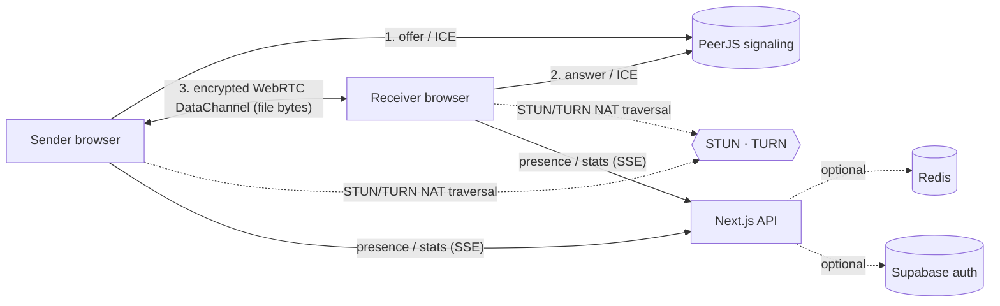

<div align="center">

# ⚡ Zync — private, peer-to-peer file transfer

**Zync** beams files directly from one browser to another over an encrypted
WebRTC connection. Files are never uploaded to or stored on a server — when the
sender closes the tab, the transfer is gone. No installs, no size limits.

[](https://vercel.com/new/clone?repository-url=https://github.com/zestcommerce841428-png/zync)


> Built by **Naushad Alam** · engineered with **Claude** · operated under ZestCommerce.

Live transfer tool, a marketing site, a 140-article blog, 15 in-browser tools,
optional accounts, and a full accessibility suite — all in one production-ready
Next.js app.

</div>

---

## 📑 Table of contents

- [Features](#-features)
- [How it works](#-how-it-works)
- [Architecture](#-architecture)
- [Screenshots](#-screenshots)
- [Quick start](#-quick-start)
- [Deploy free](#-deploy-free-in-3-minutes-no-domain-no-credit-card)
- [Configuration](#️-configuration)
- [Tech stack](#-tech-stack)
- [Scripts](#-scripts)
- [Contact](#-contact)
- [License](#-license)

---

## ✨ Features

### Transfer engine
- **True peer-to-peer** file transfer via WebRTC DataChannels (PeerJS)
- **End-to-end encrypted** by default (WebRTC DTLS) + optional password lock
- **No server storage** — nothing is retained after a transfer
- **Rooms**: multiple recipients, optional **download caps**
- **Resumable** transfers (offset persistence) and **live presence** via SSE
- **Real-time stats** dashboard at `/stats`

### Product & site
- Professional **landing page**, About, Contact, and full **compliance** suite
  (Privacy, Terms, Cookies, Acceptable Use, DMCA)
- **Blog** with 140+ SEO-ready articles, full-text **search**, category
  **filters**, and **pagination**
- **Material UI** design system with light/dark and dynamic theming
- **Advanced personalization panel**: 13 accent colors, 6 fonts, density,
  radius, text scaling, RTL, and a deep **accessibility** suite (contrast,
  saturation, reduced motion, dyslexia spacing, reading guide, big cursor,
  enhanced focus, link/heading highlights, and more)

### Platform
- **Supabase** auth (Login with Google), profile + avatar upload
- **Super-admin** dashboard (`/admin`) gated by an email allowlist
- **Hostinger SMTP** contact form + **profile-photo upload** API
- **Google Analytics** + **reCAPTCHA v3** (env-gated)
- **Per-IP rate limiting**, signed anonymous sessions, security headers
- SEO: dynamic **sitemap**, **robots**, **JSON-LD**, OpenGraph image, canonical URLs

Every integration is **optional** — the app runs fully without any keys and
lights features up as you add them.

---

## 🔄 How it works

1. The **sender** drops a file. The browser slices it and waits — nothing is
   uploaded yet.
2. Zync mints a short link. The **receiver** opens it.
3. Both browsers exchange connection info through a lightweight **PeerJS
   signaling** server and punch through NAT using **STUN/TURN**.
4. A direct, **DTLS-encrypted WebRTC DataChannel** opens between the two
   browsers and the file streams across — chunk by chunk, with backpressure so
   there's **no size limit**.
5. Close the tab and it's gone. The server never sees a byte of the file.

## 🏗 Architecture



> The Next.js server only handles **signaling, presence, stats and accounts** —
> **file bytes flow peer-to-peer and never touch it.**

## 📸 Screenshots

> _Drop your own screenshots into `docs/screenshots/` and they'll render here._

| Landing | Send a file | Tools |
| --- | --- | --- |
|  |  |  |

---

## 🚀 Quick start

```bash
pnpm install
pnpm dev          # http://localhost:3000
```

Regenerate the blog content (already committed):

```bash
node scripts/generate-blog.mjs
```

## 🚢 Deploy free in ~3 minutes (no domain, no credit card)

You get a free `*.vercel.app` (or `*.onrender.com`) subdomain. Transfers,
blog, 15 tools, themes, accessibility and **free TURN/STUN work with zero
config** — peers connect out of the box via public STUN + Metered Open Relay.

### Option A — Vercel (recommended)

[](https://vercel.com/new/clone?repository-url=https://github.com/zestcommerce841428-png/zync)

1. Click the button → import → **Deploy**. Live at `https://zync-xxx.vercel.app`.
2. Add one env var `NEXT_PUBLIC_SITE_URL = https://your-app.vercel.app`, redeploy.
3. (Optional) add Supabase / Upstash / SMTP keys to unlock accounts, scaling
   and email — see below. **None are required to launch.**

### Option B — Render Blueprint (app + PeerJS together)

The included **[`render.yaml`](render.yaml)** deploys the app *and* a
self-hosted PeerJS server on free tiers. Render → New → **Blueprint** → pick
this repo. Free `*.onrender.com` subdomains, no card.

> Full guides: **[docs/DEPLOYMENT.md](docs/DEPLOYMENT.md)** (every free service,
> with/without credit card) and **[docs/CONFIGURATION.md](docs/CONFIGURATION.md)**
> (every environment variable).

## ⚙️ Configuration

Copy `.env.local.example` to `.env.local` and fill in only what you need:

| Area | Variables |
| --- | --- |
| Site | `NEXT_PUBLIC_SITE_URL` |
| Scaling | `REDIS_URL` |
| Auth/Storage | `NEXT_PUBLIC_SUPABASE_URL`, `NEXT_PUBLIC_SUPABASE_ANON_KEY`, `SUPABASE_AVATAR_BUCKET` |
| Admin | `ADMIN_EMAILS` |
| Email | `SMTP_HOST`, `SMTP_PORT`, `SMTP_USER`, `SMTP_PASS`, `SMTP_FROM` |
| Photo upload fallback | `HOSTINGER_UPLOAD_URL`, `HOSTINGER_API_TOKEN` |
| Analytics | `NEXT_PUBLIC_GA_ID` |
| reCAPTCHA | `NEXT_PUBLIC_RECAPTCHA_SITE_KEY`, `RECAPTCHA_SECRET_KEY` |
| WebRTC TURN | `COTURN_ENABLED`, `TURN_HOST`, `TURN_REALM`, `STUN_SERVER` |

## 🧱 Tech stack

- **Next.js 16** (App Router, Turbopack) · **React 19** · **TypeScript**
- **Material UI** + Emotion
- **WebRTC** via PeerJS · **Redis** (optional) for scaling
- **Supabase** (auth + storage) · **Nodemailer** (SMTP)
- **Vitest** + **Playwright**

## 📜 Scripts

```bash
pnpm dev          # dev server
pnpm build        # production build
pnpm type:check   # TypeScript
pnpm test         # unit tests
pnpm test:e2e     # Playwright
```

## 📬 Contact

- Email: **contact@zestcommere.in**
- WhatsApp: **+91 7492068998**

## 📄 License

BSD-3-Clause. Originally based on the open-source FilePizza project; reworked
and extended into Zync.
