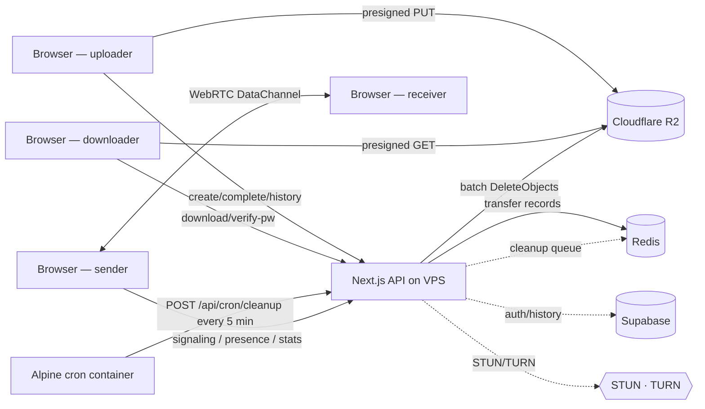

<div align="center">

# ⚡ Zync — Private File Transfer & Tools Platform

**Zync** is a full-featured, production-ready file-transfer and browser-tools platform.  
It combines **peer-to-peer WebRTC transfers** (no server, no size limit) with a **WeTransfer-style cloud transfer system** (Cloudflare R2, up to 2 GB), 15 in-browser tools, a 140-article blog, full accounts, and a deep accessibility suite — all in one Next.js app.

[](https://vercel.com/new/clone?repository-url=https://github.com/zestcommerce841428-png/zync)
[](https://render.com/deploy?repo=https://github.com/zestcommerce841428-png/zync)


> Built by **Naushad Alam** · engineered with **Claude** · operated under ZestCommerce.

</div>

---

## 📑 Table of contents

- [Features](#-features)
- [Architecture](#-architecture)
- [Storage & cleanup approach](#-storage--cleanup-approach)
- [Security](#-security)
- [Quick start](#-quick-start)
- [Deploy](#-deploy)
- [Configuration](#️-configuration)
- [Tech stack](#-tech-stack)
- [Scripts](#-scripts)
- [Contact](#-contact)
- [License](#-license)

---

## ✨ Features

### 🚀 Cloud file transfer (WeTransfer-style)
| Feature | Detail |
|---|---|
| **Upload & share link** | Drag-drop or folder upload up to **2 GB**, up to 20 files |
| **Folder upload** | Drag an entire folder — flattened via FileSystem API |
| **Password protection** | SHA-256 hashed, rate-limited verify endpoint |
| **Custom expiry** | 1 / 3 / 7 days (free) · 14 / 30 days (signed-in) |
| **Download limit cap** | Set max downloads per link |
| **Burn after read** | R2 objects deleted 30 s after first download |
| **Email to recipients** | Transactional HTML email sent on upload complete |
| **Sender confirmation email** | "Your transfer is ready" email to uploader |
| **Notify on download** | Email alert to sender on first download |
| **Transfer history** | Per-user history with copy/delete/open, auth-gated |
| **Image thumbnails** | Inline presigned R2 preview thumbnails in file list |
| **Image/video/PDF preview** | Full-screen dialog — no download required |
| **Download all as ZIP** | Client-side ZIP built with fflate, no server involved |
| **Upload speed & ETA** | Real-time MB/s + time remaining via 3-second sliding window |
| **Social share** | WhatsApp · Telegram · X/Twitter · Email · Web Share API |
| **QR code** | Auto-generated on the share screen |
| **Zero egress cost** | R2 presigned URLs — file bytes bypass the VPS entirely |

### 🔄 Peer-to-peer transfer (WebRTC)
- True **browser-to-browser** transfer via WebRTC DataChannels (PeerJS)
- **End-to-end encrypted** by default (DTLS) — server sees zero bytes
- **No size limit** — backpressure streaming
- Live **presence** (SSE), **resumable** transfers, download caps

### 🔧 15 in-browser tools
Image compression, PDF tools, text utilities, video tools — all client-side, no upload.

### 🌐 Site & platform
- Professional **landing page**, blog (140+ articles), About, Contact, compliance pages
- **Supabase** auth — Login with Google, TOTP 2FA, profile + avatar
- **Super-admin** dashboard at `/admin` (email allowlist)
- **Advanced personalization**: 13 accent colors, 6 fonts, 8 theme presets, density, radius, text scaling, RTL
- **Deep accessibility suite**: high contrast, grayscale, reduced motion, dyslexia spacing, reading guide, big cursor, focus ring, link/heading highlights, and more
- Theme & accessibility buttons in the **header** (Tune + Accessibility icons)
- **First-visit welcome dialog** highlighting all features
- Scroll-to-top **and** scroll-to-bottom floating buttons
- **Google Analytics** + **reCAPTCHA v3** (env-gated)
- SEO: dynamic sitemap, robots, JSON-LD, OpenGraph, canonical URLs
- **Cookie consent** banner (GDPR)

---

## 🏗 Architecture



> **Cloud transfers**: file bytes flow **browser → R2 → browser** via presigned URLs — the VPS never touches them.  
> **P2P transfers**: file bytes flow **browser → browser** directly — the server only handles signaling.

---

## 🗄 Storage & cleanup approach

Cloudflare R2 is charged for **storage** ($/GB-month) and **Class A operations** (PUT). There are **zero egress fees** — downloads are free.

### How cleanup works

1. **On create**: each transfer is registered in a Redis sorted set (`transfer:cleanup`) with score = `expiresAt` ms.
2. **Cron container**: an Alpine Docker container runs `crond` and calls `POST /api/cron/cleanup` (Bearer auth) every **5 minutes**. The endpoint batch-deletes up to 500 expired R2 objects per run using S3 `DeleteObjects`.
3. **Burn after read**: on first download the cleanup entry is overwritten with score = `now + 30s`, and the Redis key TTL is set to 30 s — guaranteeing instant deletion within the grace window.
4. **Belt-and-suspenders**: `sweepExpiredTransfers()` is also called fire-and-forget on every create and download request, so cleanup still happens on low-traffic sites without the cron container.

This means files are deleted **immediately at expiry** (within 5 minutes worst case), not after days.

---

## 🔒 Security

| Control | Implementation |
|---|---|
| Auth-gated routes | `/transfer` (upload), `/transfer/history`, `/admin`, `/send`, `/account`, `/profile` |
| Public routes | `/transfer/[slug]` download pages — share links work without login |
| Rate limiting | Redis fixed-window: 10 creates/10 min, 15 downloads/5 min, 5 pw-attempts/10 min per IP |
| Password hashing | SHA-256 (ephemeral transfer passwords) |
| Cron endpoint | Bearer `CRON_SECRET` — not accessible to the public internet |
| Content Security Policy | Full allowlist covering R2, Supabase, GA, reCAPTCHA, fonts, WebRTC |
| Security headers | X-Frame-Options, X-Content-Type-Options, Referrer-Policy, Permissions-Policy |
| No secrets in repo | All keys are env vars; `.env.local.example` contains only placeholders |
| www → non-www | 301 redirect at nginx-proxy level + Next.js middleware belt-and-suspenders |

---

## 🚀 Quick start

```bash
git clone https://github.com/zestcommerce841428-png/zync.git
cd zync
pnpm install
cp .env.local.example .env.local   # fill in what you need (everything optional)
pnpm dev                            # http://localhost:3000
```

For full WebRTC testing (STUN/TURN + Redis):

```bash
pnpm dev:full
```

---

## 🚢 Deploy

### Option A — Vercel (fastest, free tier)

[](https://vercel.com/new/clone?repository-url=https://github.com/zestcommerce841428-png/zync)

Set `NEXT_PUBLIC_SITE_URL` → redeploy. Zero config for P2P + tools + blog.  
Add Supabase / Redis / R2 / SMTP keys to unlock cloud transfers, accounts, and email.

### Option B — VPS with Docker (production, recommended)

```bash
# On your VPS
docker compose -f deploy/vps/docker-compose.hostinger.yml up -d
```

Includes: nginx-proxy + auto-HTTPS (acme-companion) + Redis + App + Watchtower (auto-update) + **cron cleanup container**.

Required env vars on VPS:

```env
NEXT_PUBLIC_SITE_URL=https://yourdomain.com
FILEPIZZA_SECRET=<64-hex>
REDIS_URL=redis://redis:6379
# Cloudflare R2 (cloud transfers)
R2_ACCOUNT_ID=
R2_ACCESS_KEY_ID=
R2_SECRET_ACCESS_KEY=
R2_BUCKET_NAME=
# Cron cleanup auth
CRON_SECRET=<32-hex>
# Supabase (accounts)
NEXT_PUBLIC_SUPABASE_URL=
NEXT_PUBLIC_SUPABASE_ANON_KEY=
SUPABASE_SERVICE_ROLE_KEY=
# SMTP (email)
SMTP_HOST=smtp.hostinger.com
SMTP_PORT=465
SMTP_USER=
SMTP_PASS=
```

### Option C — Pre-built GHCR image

```bash
docker run -p 3000:3000 \
  -e NEXT_PUBLIC_SITE_URL=http://localhost:3000 \
  -e FILEPIZZA_SECRET=$(openssl rand -hex 32) \
  ghcr.io/zestcommerce841428-png/zync:latest
```

Tags: `latest`, `main`, short commit SHA, and semver on `v*` tags.

---

## ⚙️ Configuration

All integrations are optional — the app runs without any keys and lights features up as you add them.

| Area | Variables |
|---|---|
| Site | `NEXT_PUBLIC_SITE_URL` |
| Session secret | `FILEPIZZA_SECRET` (generate: `openssl rand -hex 32`) |
| Scaling | `REDIS_URL` |
| Cloudflare R2 | `R2_ACCOUNT_ID`, `R2_ACCESS_KEY_ID`, `R2_SECRET_ACCESS_KEY`, `R2_BUCKET_NAME` |
| Cron cleanup | `CRON_SECRET` (generate: `openssl rand -hex 32`) |
| Auth & storage | `NEXT_PUBLIC_SUPABASE_URL`, `NEXT_PUBLIC_SUPABASE_ANON_KEY`, `SUPABASE_SERVICE_ROLE_KEY` |
| Admin | `ADMIN_EMAILS` (comma-separated) |
| Email | `SMTP_HOST`, `SMTP_PORT`, `SMTP_USER`, `SMTP_PASS`, `SMTP_FROM` |
| Analytics | `NEXT_PUBLIC_GA_ID` |
| reCAPTCHA | `NEXT_PUBLIC_RECAPTCHA_SITE_KEY`, `RECAPTCHA_SECRET_KEY` |
| WebRTC TURN | `COTURN_ENABLED`, `TURN_HOST`, `TURN_REALM` |

See `.env.local.example` for all variables with inline docs.

---

## 🧱 Tech stack

| Layer | Technology |
|---|---|
| Framework | Next.js 16 (App Router, Turbopack) |
| UI | React 19 · Material UI v9 · Emotion |
| Language | TypeScript 5 |
| File storage | Cloudflare R2 (S3-compatible, zero egress) |
| Cache / queues | Redis 7 (sorted-set cleanup queue, rate limiting, presence) |
| Auth | Supabase (Google OAuth, TOTP 2FA, RLS) |
| Email | Nodemailer (Hostinger SMTP) |
| P2P | PeerJS (WebRTC DataChannels, STUN/TURN) |
| In-browser ZIP | fflate (client-side, no server) |
| Testing | Vitest (unit) · Playwright (E2E) |
| Container | Docker · nginx-proxy · acme-companion · Watchtower |
| CI/CD | GitHub Actions → GHCR image → Watchtower auto-deploy |

---

## 📜 Scripts

```bash
pnpm dev            # dev server (localhost:3000)
pnpm dev:full       # dev + Redis + COTURN
pnpm build          # production build
pnpm type:check     # TypeScript check
pnpm lint:check     # ESLint
pnpm format         # Prettier
pnpm test           # Vitest unit tests
pnpm test:e2e       # Playwright E2E
pnpm ci             # full CI pipeline
```

---

## 📬 Contact

- **Live site**: [videodownloaders.cloud](https://videodownloaders.cloud)
- **Email**: contact@videodownloaders.cloud
- **WhatsApp**: +91 7492068998

---

## 📄 License

BSD-3-Clause. Originally based on the open-source [FilePizza](https://github.com/kern/filepizza) project;
substantially reworked and extended into Zync.
